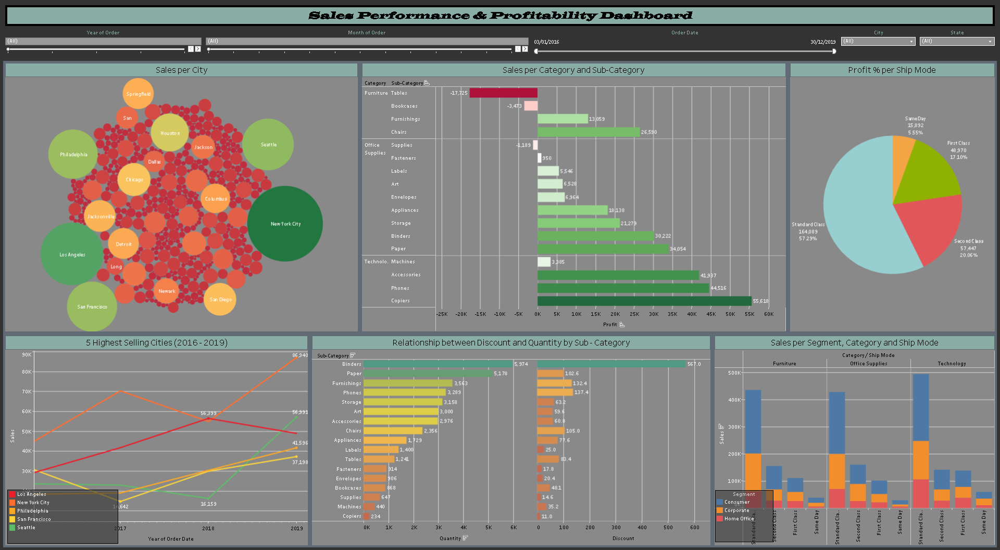

# 📊 Sales Performance & Profitability Dashboard – Tableau

### 🔗 **View the Live Dashboard on Tableau Public**  
👉 https://public.tableau.com/views/FinalassignmentTableau_17397000445780/Dashboard1

---

## 📝 **Overview**

The **Sales Performance & Profitability Dashboard** is an interactive Tableau visualization designed to help businesses analyze their sales activity, revenue patterns, product profitability, and regional performance.  
It enables quick decision-making through dynamic filtering, drilldowns, and visually clear KPIs.

---

## 🔍 **Key Insights**

### **📈 Revenue & Sales Trends**
- Analyze total sales over time  
- Detect seasonal or monthly performance fluctuations  

### **💰 Profitability Analysis**
- Identify most/least profitable products  
- Evaluate customer-level profit contribution  

### **🌍 Regional Breakdown**
- Compare sales and profits across regions  
- Spot top-performing and underperforming areas  

### **📌 KPI Monitoring**
- Revenue growth  
- Profit margins  
- Sales efficiency metrics  

### **🎚️ Interactive Features**
- Filters by product category, region, and time  
- Drilldown capabilities for deeper insights  
- Dynamic calculations for more flexible analysis  

---

## 📂 **Data & Techniques Used**

- **Data Source:** [Workearly](https://www.workearly.gr/)  
- **Techniques & Features:**  
  - Calculated fields  
  - Dynamic filtering  
  - Parameter controls  
  - Interactive dashboards  
  - Clean & business-friendly design  

---

## 🎯 **My Contribution**

I designed this dashboard with a focus on:
- Business-oriented KPIs  
- Effective data storytelling  
- User-friendly interactivity  
- Clean, modern visualization layout  

The goal was to offer **actionable insights** that improve strategy and decision-making.

---

## 🖼️ **Screenshots**

